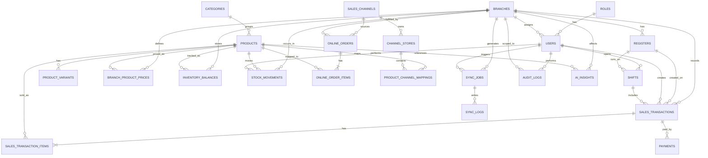

# ERD Awal

## 1. Informasi Dokumen

- Nama produk: Omnia
- Nama dokumen: ERD Awal
- Versi: 1.0
- Tanggal: 2026-04-28
- Referensi:
  - `docs/PRD-Hybrid-Omnichannel-Smart-POS.md`
  - `docs/MVP-Hybrid-Omnichannel-Smart-POS.md`
  - `docs/High-Level-Architecture-Hybrid-Omnichannel-Smart-POS.md`
  - `docs/User-Flow-Utama-Hybrid-Omnichannel-Smart-POS.md`

## 2. Tujuan Dokumen

Dokumen ini mendefinisikan ERD awal untuk MVP Omnia pada level logis. Fokusnya adalah:

- menentukan entitas utama
- menentukan relasi antar entitas
- menentukan boundary data cabang dan pusat
- menjadi dasar untuk schema database dan API contract

Dokumen ini belum membahas:

- tipe data final per kolom
- index fisik database
- partisi, sharding, atau optimasi engine
- versi final schema sinkronisasi

## 3. Prinsip Model Data

- POS bersifat `local-first`, tetapi pusat menjadi sumber konsolidasi final.
- Setiap transaksi dan mutasi stok harus dapat diaudit.
- Harga produk dapat berbeda per cabang.
- Tidak ada mekanisme retur pada MVP.
- Marketplace pertama adalah Shopee.
- Semua cabang aktif dapat memenuhi order online.
- Saat konflik data terjadi, keputusan akhir mengikuti kontrol pusat.

## 4. Cakupan ERD MVP

ERD awal ini mencakup domain berikut:

- user dan access control
- cabang dan register
- master produk dan harga per cabang
- stok dan mutasi stok
- transaksi penjualan POS
- pembayaran tercatat
- order online Shopee
- mapping SKU channel
- sinkronisasi
- audit log
- insight AI dasar

## 5. Diagram ERD Tingkat Tinggi

## 6. Entitas Utama

### 6.1 Roles

Tujuan:

- mendefinisikan role utama pada MVP

Kolom logis utama:

- id
- code
- name
- description
- is_active

Catatan:

- Role MVP: `cashier`, `store_supervisor`, `hq_admin`, `executive_analyst`

### 6.2 Users

Tujuan:

- menyimpan akun pengguna aplikasi

Kolom logis utama:

- id
- role_id
- branch_id
- full_name
- email atau username
- password_hash
- pin_hash opsional
- is_active
- last_login_at
- created_at
- updated_at

Catatan:

- Pada MVP, satu user diasumsikan memiliki cabang utama.
- Jika nanti perlu multi-branch access yang lebih kompleks, dapat ditambah tabel pivot.

### 6.3 Branches

Tujuan:

- mendefinisikan cabang operasional

Kolom logis utama:

- id
- code
- name
- address
- phone opsional
- status
- is_active
- created_at
- updated_at

### 6.4 Registers

Tujuan:

- merepresentasikan terminal atau register kasir per cabang

Kolom logis utama:

- id
- branch_id
- code
- name
- device_identifier opsional
- is_active
- created_at
- updated_at

### 6.5 Shifts

Tujuan:

- mencatat sesi buka/tutup kas

Kolom logis utama:

- id
- branch_id
- register_id
- opened_by_user_id
- closed_by_user_id opsional
- opened_at
- closed_at opsional
- opening_cash_amount opsional
- closing_cash_amount opsional
- status

## 7. Master Data Produk

### 7.1 Categories

Tujuan:

- mengelompokkan produk

Kolom logis utama:

- id
- name
- parent_category_id opsional
- is_active

### 7.2 Products

Tujuan:

- menyimpan master produk utama

Kolom logis utama:

- id
- category_id
- sku
- barcode opsional
- name
- description opsional
- unit
- is_active
- created_at
- updated_at

Catatan:

- `sku` harus unik di level global sistem.

### 7.3 ProductVariants

Tujuan:

- mendukung varian dasar produk pada MVP

Kolom logis utama:

- id
- product_id
- variant_name
- variant_value
- is_active

Catatan:

- Jika variasi produk sederhana, implementasi awal bisa tetap minimal.

### 7.4 BranchProductPrices

Tujuan:

- menyimpan harga jual produk per cabang

Kolom logis utama:

- id
- branch_id
- product_id
- selling_price
- effective_from opsional
- effective_to opsional
- is_active
- updated_by_user_id opsional

Catatan:

- Tabel ini penting karena harga dapat berbeda antar cabang.

## 8. Inventory

### 8.1 InventoryBalances

Tujuan:

- menyimpan stok terkini per produk per cabang

Kolom logis utama:

- id
- branch_id
- product_id
- quantity_on_hand
- minimum_stock_threshold opsional
- updated_at

Catatan:

- Ini adalah snapshot stok terkini.
- Perubahan stok tetap harus berasal dari `stock_movements`.

### 8.2 StockMovements

Tujuan:

- menjadi ledger mutasi stok

Kolom logis utama:

- id
- branch_id
- product_id
- source_type
- source_id opsional
- movement_type
- quantity_delta
- quantity_before opsional
- quantity_after opsional
- reason_code
- notes opsional
- performed_by_user_id
- movement_at
- sync_status opsional

Contoh `movement_type`:

- sale_out
- stock_in
- adjustment_plus
- adjustment_minus
- sync_correction

Catatan:

- Semua perubahan stok operasional harus menghasilkan record di tabel ini.

## 9. Transaksi POS

### 9.1 SalesTransactions

Tujuan:

- mencatat header transaksi penjualan

Kolom logis utama:

- id
- transaction_no
- branch_id
- register_id
- shift_id
- cashier_user_id
- transaction_datetime
- subtotal_amount
- discount_amount
- tax_amount
- total_amount
- payment_status
- transaction_status
- source_mode
- local_reference_id opsional
- central_resolution_status opsional
- synced_at opsional
- created_at

Contoh `source_mode`:

- online
- offline

Contoh `payment_status`:

- pending
- paid
- partially_paid

Contoh `transaction_status`:

- completed
- voided

Catatan:

- Tidak ada retur pada MVP.

### 9.2 SalesTransactionItems

Tujuan:

- mencatat item per transaksi

Kolom logis utama:

- id
- sales_transaction_id
- product_id
- product_name_snapshot
- sku_snapshot
- unit_price
- quantity
- discount_amount
- tax_amount
- line_total

Catatan:

- Snapshot nama dan SKU menjaga histori transaksi tetap stabil walau master data berubah.

### 9.3 Payments

Tujuan:

- mencatat pembayaran transaksi pada MVP tanpa payment gateway langsung

Kolom logis utama:

- id
- sales_transaction_id
- payment_method_code
- amount
- payment_status
- payment_reference opsional
- paid_at opsional
- notes opsional

Contoh `payment_method_code`:

- cash
- transfer
- card_manual_record
- ewallet_manual_record

Catatan:

- Tabel ini mencatat flow pembayaran, bukan koneksi langsung ke gateway.

## 10. Omnichannel dan Shopee

### 10.1 SalesChannels

Tujuan:

- mendefinisikan channel penjualan

Kolom logis utama:

- id
- code
- name
- type
- is_active

Contoh:

- pos_offline
- shopee

### 10.2 ChannelStores

Tujuan:

- merepresentasikan store atau akun channel yang terhubung

Kolom logis utama:

- id
- sales_channel_id
- store_name
- external_store_id
- auth_status
- is_active
- connected_at opsional

### 10.3 ProductChannelMappings

Tujuan:

- memetakan SKU internal ke SKU channel

Kolom logis utama:

- id
- channel_store_id
- product_id
- external_product_id
- external_sku
- mapping_status
- created_by_user_id
- created_at
- updated_at

Catatan:

- Tabel ini wajib untuk import order Shopee.

### 10.4 OnlineOrders

Tujuan:

- mencatat order online yang masuk dari Shopee

Kolom logis utama:

- id
- sales_channel_id
- channel_store_id
- external_order_id
- branch_id opsional
- order_datetime
- order_status
- payment_status
- subtotal_amount opsional
- discount_amount opsional
- shipping_amount opsional
- total_amount opsional
- raw_payload_ref opsional
- imported_at
- processed_at opsional

Catatan:

- `branch_id` dapat menunjuk cabang yang akhirnya terkait dengan pemenuhan atau kontrol order pada MVP.

### 10.5 OnlineOrderItems

Tujuan:

- mencatat item pada order online

Kolom logis utama:

- id
- online_order_id
- product_id opsional
- external_product_id opsional
- external_sku opsional
- product_name_snapshot
- unit_price
- quantity
- line_total
- mapping_status

Catatan:

- `product_id` bisa kosong sementara jika mapping belum ditemukan.

## 11. Sinkronisasi

### 11.1 SyncJobs

Tujuan:

- merepresentasikan satu pekerjaan sinkronisasi dari cabang ke pusat atau sebaliknya

Kolom logis utama:

- id
- branch_id
- triggered_by_user_id opsional
- job_type
- entity_type
- entity_id opsional
- payload_reference opsional
- status
- attempt_count
- last_attempt_at opsional
- next_retry_at opsional
- created_at

Contoh `job_type`:

- push_transaction
- push_stock_movement
- pull_master_data
- reconcile_branch_data

Contoh `status`:

- pending
- processing
- success
- failed
- conflict

### 11.2 SyncLogs

Tujuan:

- menyimpan jejak detail dari pelaksanaan sync job

Kolom logis utama:

- id
- sync_job_id
- log_level
- message
- error_code opsional
- logged_at

Catatan:

- Digunakan untuk monitoring dan troubleshooting.

## 12. Audit dan Insight

### 12.1 AuditLogs

Tujuan:

- mencatat aktivitas sensitif dan perubahan penting

Kolom logis utama:

- id
- user_id
- branch_id opsional
- entity_type
- entity_id
- action
- old_value_ref opsional
- new_value_ref opsional
- note opsional
- created_at

Contoh `action`:

- login
- create_transaction
- void_transaction
- stock_adjustment
- update_branch_price
- update_product_mapping

### 12.2 AIInsights

Tujuan:

- menyimpan hasil insight AI dasar yang ditampilkan ke user

Kolom logis utama:

- id
- branch_id opsional
- product_id opsional
- insight_type
- title
- summary
- confidence_score opsional
- generated_at
- valid_until opsional

Contoh `insight_type`:

- low_stock_alert
- stockout_prediction
- sales_trend_summary

## 13. Relasi Kunci yang Perlu Dijaga

Relasi yang paling penting untuk MVP:

- satu `role` memiliki banyak `users`
- satu `branch` memiliki banyak `registers`
- satu `branch` memiliki banyak `users`
- satu `product` memiliki banyak `branch_product_prices`
- satu `branch` dan satu `product` memiliki satu `inventory_balance` aktif
- satu `sales_transaction` memiliki banyak `sales_transaction_items`
- satu `sales_transaction` memiliki satu atau banyak `payments`
- satu `online_order` memiliki banyak `online_order_items`
- satu `channel_store` memiliki banyak `product_channel_mappings`
- satu `sync_job` memiliki banyak `sync_logs`

## 14. Boundary Data Cabang vs Pusat

### Data yang Disimpan Lokal di Cabang

- transaksi POS
- item transaksi
- pembayaran tercatat
- stok per cabang
- mutasi stok
- session user lokal minimum
- sync queue

### Data yang Menjadi Konsolidasi Final di Pusat

- master produk
- harga per cabang
- data transaksi yang sudah tersinkron
- stock ledger pusat
- order Shopee
- mapping SKU channel
- audit log global
- AI insights

## 15. Catatan Normalisasi dan Implementasi

- Snapshot data pada transaksi disarankan untuk menjaga histori tetap stabil.
- `inventory_balances` adalah tabel status, sedangkan `stock_movements` adalah sumber perubahan.
- `branch_product_prices` lebih aman dipisah dari `products` karena harga berbeda per cabang.
- `online_orders` dan `sales_transactions` dipisah agar alur omnichannel tetap jelas.
- `sync_jobs` dan `sync_logs` dipisah agar monitoring lebih rapi.

## 16. Open Points untuk Versi Berikutnya

Hal yang bisa diperdalam pada versi ERD berikutnya:

- apakah `users` perlu multi-branch pivot table
- apakah `inventory_balances` perlu reserved stock field
- apakah `online_orders` perlu allocation table khusus antar cabang
- apakah `ai_insights` perlu relasi ke tabel agregat atau snapshot source
- bagaimana memodelkan raw payload Shopee secara final

## 17. Kesimpulan

ERD awal ini sudah cukup untuk menjadi fondasi desain database MVP Omnia karena sudah mencakup:

- operasional POS cabang
- inventory dan stock movement
- transaksi dan pembayaran tercatat
- integrasi Shopee
- sinkronisasi hybrid
- audit dan AI insight dasar

Langkah paling tepat berikutnya setelah ERD ini adalah membuat `sync specification detail`, karena sinkronisasi akan menentukan bagaimana entitas-entitas ini bergerak antara cabang dan pusat.
