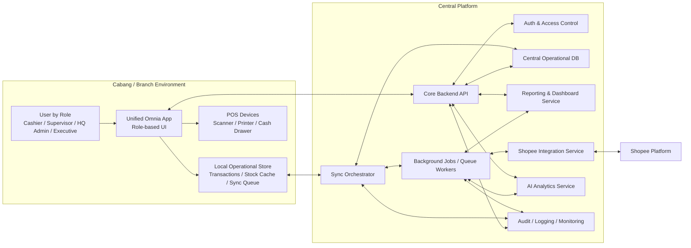

# High-Level System Architecture

## 1. Informasi Dokumen

- Nama produk: Omnia
- Nama dokumen: High-Level System Architecture
- Versi: 1.0
- Tanggal: 2026-04-28
- Referensi:
  - `docs/PRD-Hybrid-Omnichannel-Smart-POS.md`
  - `docs/MVP-Hybrid-Omnichannel-Smart-POS.md`

## 2. Tujuan Dokumen

Dokumen ini menjelaskan arsitektur sistem tingkat tinggi untuk Omnia berdasarkan keputusan produk berikut:

- satu aplikasi utama berbasis role
- hybrid local-first untuk POS
- dashboard, integrasi Shopee, dan AI berjalan terpusat
- konflik data akhir dikendalikan pusat
- MVP belum menggunakan payment gateway langsung
- semua cabang aktif dapat memenuhi order online

Dokumen ini dipakai sebagai acuan sebelum masuk ke:

- ERD
- sync specification
- technical stack decision
- backlog engineering

## 3. Prinsip Arsitektur

Arsitektur Omnia harus mengikuti prinsip berikut:

- `One product experience`
  User menggunakan satu aplikasi utama dengan menu yang berubah berdasarkan role.

- `Local-first POS`
  Operasional kasir cabang tetap berjalan walau koneksi ke pusat terputus.

- `Central control`
  Pusat menjadi sumber keputusan akhir untuk konsolidasi data, reporting, dan penyelesaian konflik.

- `Modular by domain`
  Walau secara produk terlihat satu aplikasi, sistem dipisah menjadi domain POS, dashboard, integration, dan AI.

- `Async by default`
  Sinkronisasi, integrasi channel, dan analytics tidak boleh menghambat checkout.

- `Observable and auditable`
  Semua aktivitas penting harus dapat ditelusuri.

## 4. Gambaran Solusi

Omnia dibangun sebagai sistem hybrid dengan pembagian tanggung jawab berikut:

- `Aplikasi utama cabang`
  Dipakai untuk POS operasional dan akses modul lain sesuai role.

- `Layanan pusat`
  Menangani API utama, sinkronisasi, kontrol data, dashboard, integrasi Shopee, dan AI.

- `Penyimpanan lokal cabang`
  Menyimpan transaksi dan data penting agar POS tetap bisa berjalan saat offline.

- `Penyimpanan pusat`
  Menjadi basis konsolidasi, dashboard, dan analytics.

## 5. Diagram Arsitektur Tingkat Tinggi

## 6. Komponen Utama

### 6.1 Unified Omnia App

Aplikasi utama yang dipakai semua role.

Tanggung jawab:

- menampilkan UI sesuai role
- menjalankan flow POS
- menampilkan dashboard sesuai hak akses
- menampilkan status sinkronisasi
- menyimpan data operasional lokal
- mengirim dan menerima data ke/dari pusat

Catatan:

- Secara produk ini adalah satu aplikasi.
- Secara teknis UI dan logic harus dipisah modular.

### 6.2 Local Operational Store

Lapisan penyimpanan lokal di cabang.

Tanggung jawab:

- menyimpan transaksi saat online atau offline
- menyimpan stok lokal dan mutasi stok lokal
- menyimpan cache data produk, harga per cabang, dan konfigurasi minimum
- menyimpan sync queue dan sync state

Data yang disimpan lokal pada MVP:

- user session minimum
- produk dan harga per cabang yang dibutuhkan cabang
- stok per cabang
- transaksi
- item transaksi
- metode pembayaran tercatat
- status pembayaran
- stock movement
- sync jobs lokal

### 6.3 Core Backend API

Layanan pusat yang menjadi pintu utama komunikasi aplikasi dengan platform pusat.

Tanggung jawab:

- autentikasi dan otorisasi
- menerima sync dari cabang
- menyediakan data pusat untuk dashboard
- menyediakan endpoint master data
- menyediakan endpoint status sync
- menyediakan akses ke insight AI dan status order Shopee

### 6.4 Auth & Access Control

Tanggung jawab:

- login
- session validation
- role-based authorization
- branch-level access control

Role MVP:

- Cashier
- Store Supervisor
- HQ Admin
- Executive / Analyst

### 6.5 Sync Orchestrator

Komponen paling penting pada model hybrid.

Tanggung jawab:

- menerima data transaksi dan stok dari cabang
- menandai status sync
- menjalankan replay untuk data offline
- mendeteksi duplikasi event
- menerapkan idempotency
- mengeskalasi konflik data ke kontrol pusat

Aturan utama:

- checkout tidak bergantung pada keberhasilan sync langsung
- pusat memegang keputusan final saat konflik

### 6.6 Central Operational Database

Database pusat untuk data operasional final.

Tanggung jawab:

- menyimpan hasil konsolidasi transaksi
- menyimpan master data
- menyimpan stok pusat per cabang
- menyimpan order Shopee
- menyimpan audit log dan sync log

Catatan:

- Database ini bukan pengganti penyimpanan lokal cabang.
- Database ini menjadi basis utama reporting dan analytics.

### 6.7 Background Jobs / Queue Workers

Tanggung jawab:

- memproses sync queue
- memproses webhook Shopee
- memproses retry gagal integrasi
- membangun agregasi data dashboard
- memicu analisis AI berkala

Prinsip:

- semua proses berat dipindahkan dari jalur checkout

### 6.8 Reporting & Dashboard Service

Tanggung jawab:

- menyediakan KPI untuk dashboard
- menyediakan laporan per cabang dan lintas cabang
- menyediakan ringkasan channel offline dan Shopee

Sumber data:

- data pusat yang sudah terkonsolidasi
- data agregat hasil background jobs

### 6.9 Shopee Integration Service

Tanggung jawab:

- koneksi ke akun/store Shopee
- pemrosesan webhook/event Shopee
- mapping SKU Shopee ke SKU internal
- import order Shopee
- update status order
- sinkron stok dasar ke Shopee

Prinsip:

- integrasi channel tidak boleh mengganggu POS core

### 6.10 AI Analytics Service

Tanggung jawab:

- alert stok menipis
- prediksi stockout sederhana
- tren penjualan dasar
- ringkasan insight

Prinsip:

- AI hanya advisory
- AI membaca data pusat, bukan storage lokal cabang

### 6.11 Audit, Logging, and Monitoring

Tanggung jawab:

- mencatat aktivitas penting
- memantau kesehatan sync
- memantau error integrasi
- memantau cabang offline
- mendukung investigasi dan debugging

## 7. Pembagian Domain

### 7.1 POS Domain

Mencakup:

- transaksi penjualan
- cart
- pembayaran tercatat
- shift dasar
- cetak struk
- update stok akibat penjualan

### 7.2 Inventory Domain

Mencakup:

- stok per cabang
- stock movement
- adjustment stok
- stok minimum

### 7.3 Master Data Domain

Mencakup:

- produk
- kategori
- SKU
- harga per cabang
- cabang
- role dan user

### 7.4 Omnichannel Domain

Mencakup:

- Shopee order import
- channel mapping
- sinkron stok channel
- status order online

### 7.5 Analytics Domain

Mencakup:

- dashboard
- reporting
- AI insights

## 8. Deployment Model Tingkat Tinggi

### 8.1 Branch Side

Di cabang tersedia:

- aplikasi Omnia
- local operational store
- device integration layer dasar

### 8.2 Central Side

Di pusat tersedia:

- backend API
- central database
- sync orchestrator
- queue workers
- dashboard/reporting layer
- Shopee integration service
- AI analytics service
- audit dan monitoring

## 9. Alur Data Utama

### 9.1 Alur Transaksi POS Saat Online

1. User login ke aplikasi.
2. Kasir membuat transaksi.
3. Aplikasi menyimpan transaksi ke local store.
4. Stok lokal dikurangi.
5. Event transaksi masuk ke sync queue.
6. Sync orchestrator mengirim data ke pusat.
7. Central DB diperbarui.
8. Dashboard dan analytics menerima data melalui job/agregasi.

### 9.2 Alur Transaksi POS Saat Offline

1. Kasir membuat transaksi.
2. Aplikasi menyimpan transaksi ke local store.
3. Stok lokal dikurangi.
4. Event diberi status pending sync.
5. Saat koneksi kembali, sync queue direplay ke pusat.
6. Pusat menerima dan mengonsolidasikan data.

### 9.3 Alur Perubahan Harga Per Cabang

1. HQ Admin mengubah harga per cabang di pusat.
2. Perubahan disimpan di central database.
3. Update didistribusikan ke cabang terkait.
4. Cabang memperbarui cache lokal.

### 9.4 Alur Order Shopee

1. Shopee mengirim webhook/event.
2. Shopee integration service menerima event.
3. Event divalidasi dan dicek idempotency.
4. SKU Shopee dipetakan ke SKU internal.
5. Order dibentuk menjadi order internal di pusat.
6. Stok pusat diperbarui menurut aturan yang berlaku.
7. Order muncul di modul pusat/dashboard.
8. Jika error, job masuk retry queue dan error log.

### 9.5 Alur AI Analytics

1. Background jobs membentuk data agregat.
2. AI service membaca data pusat.
3. Sistem menghasilkan alert dan insight.
4. Insight disajikan ke HQ Admin atau Executive / Analyst.

## 10. Online vs Offline Capability

### 10.1 Fitur yang Harus Tetap Berjalan Saat Offline

- transaksi POS
- cart management
- pencatatan metode pembayaran
- pencatatan status pembayaran
- pengurangan stok lokal
- stok masuk / adjustment lokal sesuai hak akses
- penyimpanan transaksi dan stock movement

### 10.2 Fitur yang Dapat Terbatas Saat Offline

- dashboard pusat
- sinkronisasi Shopee
- analytics global
- update master data pusat
- distribusi harga terbaru yang belum tersinkron

## 11. Aturan Konflik Data

Aturan konflik tingkat tinggi untuk MVP:

- jika ada konflik data antar cabang, pusat menjadi pengambil keputusan akhir
- jika ada konflik data antara data lokal cabang dan data pusat, hasil final mengikuti kontrol pusat
- jika ada event duplicate, sistem harus mengabaikan duplikasi berdasarkan identifier dan idempotency rule

Implikasi:

- local-first dipakai untuk menjaga operasional
- central control dipakai untuk menjaga konsistensi bisnis

## 12. Boundary dan Tanggung Jawab Modul

### 12.1 Yang Tidak Boleh Dilakukan POS Module

- menjalankan query analytics berat
- memanggil integrasi Shopee secara blocking saat checkout
- menghitung insight AI secara langsung di jalur transaksi

### 12.2 Yang Tidak Boleh Dilakukan AI Module

- mengubah stok secara otomatis
- mengubah harga secara otomatis
- mengubah order secara otomatis

### 12.3 Yang Tidak Boleh Dilakukan Integration Module

- mengunci proses checkout saat webhook bermasalah
- langsung menulis data tanpa audit dan idempotency

## 13. Security dan Access Model Tingkat Tinggi

- semua akses harus divalidasi di backend
- role menentukan modul yang terlihat
- branch access menentukan data cabang mana yang dapat diakses
- audit log wajib untuk aksi sensitif
- session dan autentikasi harus aman

## 14. Observability Tingkat Tinggi

Sistem minimum yang perlu dipantau:

- branch online/offline status
- jumlah pending sync
- failed sync jobs
- failed Shopee webhook/import jobs
- dashboard aggregation failures
- AI job failures
- audit event volume

## 15. NFR Mapping ke Arsitektur

### 15.1 Performance

Dipenuhi dengan:

- local-first transaction write
- async sync
- background jobs
- pemisahan jalur checkout dan reporting

### 15.2 Reliability

Dipenuhi dengan:

- local queue
- retry mechanism
- idempotent processing
- central reconciliation

### 15.3 Scalability

Dipenuhi dengan:

- modular services
- integration service terpisah
- analytics terpisah dari checkout flow
- central control model untuk multi-cabang

### 15.4 Maintainability

Dipenuhi dengan:

- pemisahan domain
- boundary antar modul
- layer integrasi yang terisolasi

## 16. Risiko Arsitektur

### 16.1 Risiko Sync

- pending queue menumpuk
- duplikasi transaksi
- cabang lama offline

### 16.2 Risiko Inventory

- mismatch stok lokal vs pusat
- alokasi order online lintas cabang sulit ditelusuri

### 16.3 Risiko Integrasi Shopee

- webhook gagal
- mapping SKU salah
- retry tidak terkendali

### 16.4 Risiko Produk

- satu aplikasi menjadi terlalu padat
- role boundary bocor ke UI yang salah

## 17. Keputusan Arsitektur yang Sudah Dikunci

- satu aplikasi utama untuk seluruh role
- POS bersifat hybrid local-first
- pusat memegang kontrol final untuk konflik
- marketplace pertama adalah Shopee
- semua cabang aktif dapat memenuhi order online
- payment gateway belum masuk MVP
- retur tidak masuk MVP
- AI hanya advisory

## 18. Langkah Turunan Berikutnya

Setelah dokumen ini, artefak yang sebaiknya dibuat:

1. ERD awal
2. sync specification detail
3. API boundary / service contract
4. sitemap dan wireframe per role
5. technical stack decision

## 19. Kesimpulan

Arsitektur high-level Omnia dirancang untuk menjaga keseimbangan antara:

- kecepatan dan ketahanan operasional cabang
- kontrol dan konsolidasi data di pusat
- integrasi omnichannel
- analytics dan AI yang tidak mengganggu checkout

Dengan arsitektur ini, tim dapat melanjutkan ke desain data dan spesifikasi teknis yang lebih detail tanpa kehilangan arah produk yang sudah dikunci di PRD dan MVP.
